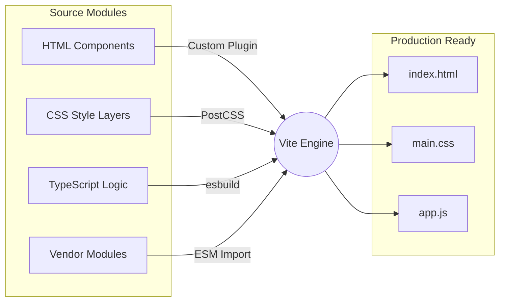

<div align="center">

# AC-DC Directionless Experience


*An ode to those who feel directionless. A high-performance, visually stunning web experience engineered with modern tooling and modular architecture.*

<!-- Professional Badges -->
<p align="center">
  
  
  
  
  
  
  
</p>

</div>

---

## 📖 Overview

The primary goal of this platform is to identify underlying emotional barriers and design innovative solutions that encourage individuals to seek timely healthcare support for depression. By leveraging an immersive, high-performance animated web experience, the project breaks down stigmas and creates a visually engaging, empathetic environment.

Behind the scenes, this highly interactive experience is powered by a robust modular architecture utilizing custom Vite plugins, segmented CSS, isolated engine scripts, and type-safe TypeScript logic to deliver a flawless 60fps emotional journey.

---

## ✨ Core Features

| Feature | Description | Stack |
| :--- | :--- | :--- |
| **Modular HTML Architecture** | Monolithic code securely split into logical partials, composed securely at build-time. | `Vite Plugin`, `HTML5` |
| **High-Performance Animations** | Smooth scrolling, complex WebGL shatter effects, and timeline orchestration. | `GSAP`, `Lenis` |
| **Layered CSS System** | Cleanly separated style layers spanning Normalize, Core, and Scoped Components. | `CSS3` |
| **Isolated Core Engine** | Compiled third-party interactive scripts sandboxed strictly in the vendor namespace. | `Vanilla JS` |
| **Type-Safe Logic** | Custom animations and DOM orchestrations are strongly typed for maintainability. | `TypeScript` |

---

## 🏗️ Architecture Design

The following flow illustrates how the modular assets compile via the Vite bundler into the final optimized production build.



---

## 📂 Code Organization

The repository relies on a strictly typed, modular architecture designed for rapid iteration and clear separation of concerns.

```text
├── assets/
│   └── images/              # Graphical assets and webp imagery
├── components/              # HTML Partials (Injected at build time)
│   ├── hero.html
│   ├── footer.html
│   └── ...
├── js/
│   ├── directionless.ts     # Main application entry point
│   └── modules/             # Segregated TS animation controllers
├── styles/                  # Segmented CSS Architecture
│   ├── main.css             # CSS entry point
│   └── ...                  # Normalize, core, and scoped styles
├── vendor/                  # Third-party isolated dependencies
│   ├── core-engine.js       # Core engine runtime map
│   └── engine_modules/      # Extracted individual module runtimes
├── vite.config.js           # Build configuration & Custom Plugins
└── package.json             # NPM dependencies
```

---

## 🚀 Installation & Usage

1. **Install Dependencies**
   ```bash
   npm install
   ```

2. **Start the Development Server**
   ```bash
   npm run dev
   ```

3. **Build for Production**
   ```bash
   npm run build
   ```

---

## 👥 Contributors

This architectural refinement and project evolution is proudly authored and maintained by:

- **Rachit Tiwari**
- **Mausam Kar**
- **Sheikh Mohammad Warsi**

---

## 📜 License

This project is licensed under the **AC-DC License**.  
See the [LICENSE](LICENSE) file for complete details and copyright permissions.
